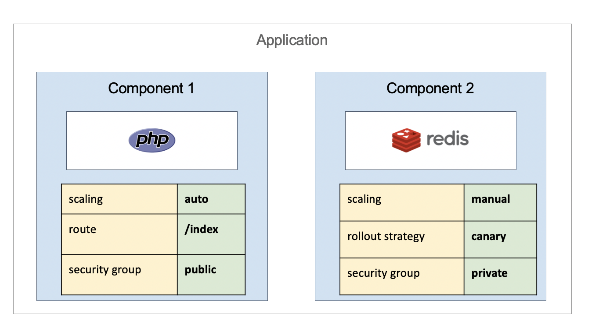

# 1. Purpose and Goals

The Open Application Model defines a standard, platform-agnostic way to describe cloud and edge applications. The goal of the specification is to provide a common way to describe applications agnostic to any specific container runtime, orchestration software, cloud provider, or hardware configuration, with clearly defined roles for end users and platform team, while still allowing implementations to make use of the native APIs, tools, and features that are unique to the implementation and its underlying platform.

The central problem this specification seeks to address is how distributed applications can be composed and then successfully handed off to those responsible for operating them. The problem is not so much about how to write programs, but how to take components of a service oriented (or microservice oriented) architecture, and streamline the workflow that surrounds such applications.

For example, a contemporary cloud application may be composed of dozens of microservices, each responsible for a discrete chunk of what, broadly speaking, is "an application." Such applications need to be configured, deployed, audited, updated, and deleted. Sometimes the application must be treated as a whole, and sometimes finer levels of granularity are required. And most importantly, often such applications are managed not by one person or one team, but by multiple teams who must cooperate to achieve reliability, stability, and timeliness.

This specification provides a description of such applications, where the description is aimed at separating the concerns of end users from the concerns of platform team. Furthermore, it suggests patterns and processes for managing such applications. The specification describes a model for cloud native (i.e. highly distributed) cloud applications, encompassing public cloud technologies, on-prem solutions, and IoT/edge technologies. By specifying a common model, this specification provides a foundation for multiple implementations of a shared description of cloud native applications.

This open specification defines:

- Component model, where developers declare the operational characteristics of the code they deliver in infrastructure neutral terms.
- Application scopes, a way to group components into loosely coupled applications with common characteristics.
- Traits for assigning operational features to instances of components.
- Application configuration, defines a deployment of components, their traits, and application scopes.
- Workload types and configurations, which describe the runtime characteristic for a particular workload, as well as exposing per-application configuration.

Additional goals of the specification are to:

- Define __roles and responsibilities__ with respect to the component and application models.
- Promote the genesis of multiple, differentiated implementations of both tooling and runtimes which can operate on a common class of components and applications.

Non-goals include:

- Defining or prescribing specific orchestrating workflow.
- Defining the schemas of operational resources, for example (but not limited
  to):
  - Secrets (secure, encrypted values)
  - Networks
  - Volumes
- Describing or defining the runtimes themselves.

| Next Part     |
| ------------- |
| [Overview and Terminology](2.overview_and_terminology.md)|
